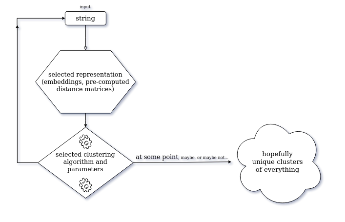
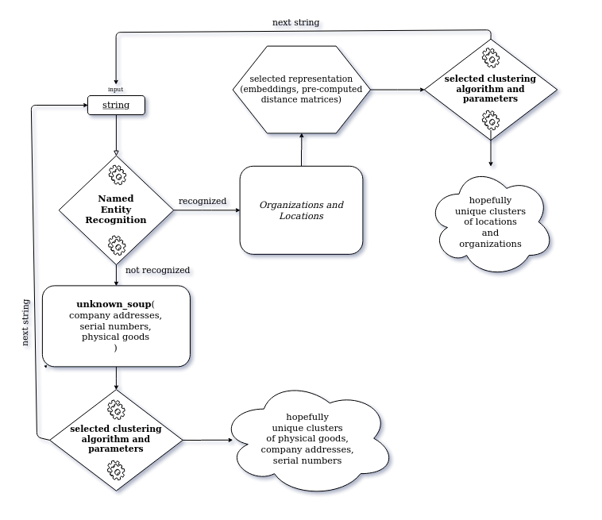

# Entity Normalization Engine
## Usage (tested on Ubuntu 18.04.4 LTS)
_note: feel free to skim-through this Readme first to get an overview, and then come back to "Usage" section_    

0.. make sure you have [miniconda](https://docs.conda.io/en/latest/miniconda.html), 
[anaconda](https://docs.anaconda.com/anaconda/install/linux/) or any other python virtual environment installed.      

1.. open a terminal and download the project:
```bash
git clone https://github.com/chrisgks/entity-normalization-engine.git
```
2.. cd to project directory:
```bash
cd entity-normalization-engine   
```
3.. create new conda env:
```bash
conda create --name vectorai python=3.8
```
4.. activate the newly created virtual environment:
```bash
conda activate vectorai  
```
5.. install pip packages:
```bash
pip install -r requirements.txt     
```
At this point we need to decide if we want to use word embeddings or pre-computed distance matrices (similar to 
node distances in graphs) to represent our inputs

  use vector representations  | use 'graph-like' representations
  ------------- | -------------
   6.. cd to vector_representation | 6.. cd to graph_representation
  ```cd vector_representation```  | ```cd graph_representation```
  7.. run main_vec script to cluster strings.txt | 7.. run main_graph script to cluster strings.txt
  ```python main_vec.py```  | ```pyton main_graph.py```


## How to 'parse' the results we just created
Depending on what _representation_ we decided to use, advise the corresponding **"Parameters, algorithms and naming
 conventions that..."** section of the Readme's in those folders, get a glimpse of how the names of the experiments
 are formed, go to the corresponding **results** folder, spot the right files and check the results!
 
 **NOTE**: The **best results** I've got so far, can be found in the following files:


```vector_representation/results/v_dbscan_euclidean_5_1_company_names_['flair_forward', 'flair_backward', 'glove'].json```
In this group, strings are classified by the Named Entity Recognition model as 'comany names'
* Where:
    * v: **string representation prefix** - v for vector
    * dbscan: clustering algorithm used
    * euclidean: **metric** used parameter,
    * 5: **epsilon** parameter,
    * 1: **min_samples** parameter,
    * company_names: **entity_name** parameter,
    * [['flair_forward', 'flair_backward', 'glove']]: **selected_base_models** parameter,

```vector_representation/results/v_dbscan_euclidean_6.5_1_locations_['flair_forward', 'flair_backward', 'glove'].json```
In this group, strings are classified by the Named Entity Recognition model as 'physical locations'

* Where (same as previous except):
    * 6.5: **epsilon** parameter,
    * 1: **min_samples** parameter,
    * locations: **entity_name** parameter


```vector_representation/results/v_dbscan_euclidean_2.5_1_unknown_soup_['flair_forward', 'flair_backward', 'glove'].json```
In this group, strings are not 'company names' nor 'physical locations' - we have 'serial numbers', 'physical goods',
and 'company adresses'
* Where (same as previous except):
    * 2.5: **epsilon** parameter,
    * 1: **min_samples** parameter,
    * locations: **entity_name** parameter
 
 
 
 **Actual Results**
 
 **Company names**
 
   cluster id | in the same cluster
  ------------- | -------------
   0  | 'MARKS AND SPENCERS LTD', 'M&S CORPORATION LIMITED'
   1  | 'NVIDIA IRELAND'
   2  | 'INTEL LLC'
   3  | 'XYZ 13423 / ILD'
   4  | 'LONDON, ENG'

 **Physical locations**
 
   cluster id | in the same cluster
  ------------- | -------------
   0  | 'LONDON', 'LONDON, GREAT BRITAIN', 'LONDON, ENGLAND'
   1  | 'HONG KONG'
   2  | 'ASIA'

**Unknown Soup** (or 'everything else')

   cluster id | in the same cluster
  ------------- | -------------
   0  | 'M&S LIMITED'
   1  | 'SLOUGH SE12 2XY'
   2  | '33 TIMBER YARD, LONDON, L1 8XY'
   3  | '44 CHINA ROAD, KOWLOON, HONG KONG'
   4  | 'ABC/ICL/20891NC'
   5  | 'HARDWOOD TABLE'
   6  | 'PLASTIC BOTTLE'
   7  | 'TOYS'
   8  | 'ICNAO02312'


### Comments on results
It is obvious that Flair's Named Entity Recognition did the following errors:
1. classified 'XYZ 13423 / ILD' and 'LONDON, ENG' as company names where the first one is a serial number and the latter
is a physical location
2. didn't classify 'M&S LIMITED' as a company name.

**But**, the clustering algorithms along with the selected parameters applied to each group respectively, didn't do any 
mistake at all!    
So, if we see the final result by merging everything into one file, we get the following result:

   final clusters | in the same cluster
  ------------- | -------------
   1  | 'MARKS AND SPENCERS LTD', 'M&S CORPORATION LIMITED'
   2  | 'NVIDIA IRELAND'
   3  | 'INTEL LLC'
   4  | 'XYZ 13423 / ILD'
   5  | 'LONDON, ENG'
   6  | 'LONDON', 'LONDON, GREAT BRITAIN', 'LONDON, ENGLAND'
   7  | 'HONG KONG'
   8  | 'ASIA'
   9  | 'M&S LIMITED'
   10  | 'SLOUGH SE12 2XY'
   11  | '33 TIMBER YARD, LONDON, L1 8XY'
   12  | '44 CHINA ROAD, KOWLOON, HONG KONG'
   13  | 'ABC/ICL/20891NC'
   14  | 'HARDWOOD TABLE'
   15  | 'PLASTIC BOTTLE'
   16  | 'TOYS'
   17  | 'ICNAO02312']
   
As we can see, parts of NER classification errors remain in this representation as well. We would like 'LONDON, ENG'
to be part of cluster 6; and, we would also like 'M&S LIMITED' to be part of cluster 1.    
Thinking of next steps, after parsing the input one by one, having obtained the clusters as we have at this point,
applying an algorithm like KNN could potentially classify the instances we described above, to the most similar neighbours.
(hopefully the correct ones)

In any case, these look like promising results and they suggest that word embeddings is probably a better way to 
represent strings in a more _'usefull and meaningful'_ way for this specific task; when compared to string similarity
 approaches. Of course, these results are tailored to the specific input strings - obtained by trying a bunch of
  different algorithms/parameter combinations. Diferrent combinations may be needed for different/bigger datasets.
 


# General notes - ideas - brainstorming - intuition

A way of thinking about this would be to build two separate systems as follows: 
1. **Raw text processing**, without taking into consideration entities, semantic information, morphology of strings, 
context, etc.. Clustering without any prior information (i.e. entity of string) or mechanism;
like string classification into entity group. Create clusters right away. We'll call this family of approaches __Team A__.
2. **Text pre-processing**, attempt to filter/predict the _entity group_ to which each input string belongs to,
 or any other information we can extract in order to classify the strings into one of the five categories 
(company names, company addresses, serial numbers, physical goods and locations). Then create initial groups of strings
 and apply the first system to every group respectively; in an attempt to decrease clustering error.
  We'll call this family of approaches __Team B__.

* Another factor we need to consider, is **string representation**. Some algorithms require **vector representation**, 
others require  _pre-computed distance matrices_, similar to those used in graphs for the same purpose. In this case
they would contain string similarities between pair of words. This is also what we'll be refering to as 
**graph representation** - just to give it a name.

## Potential Approaches
- Team A approaches - naive:
   * Naively treat all strings the same way, without taking into consideration their entity or other information. 
   Pick a clustering algorithm, string representation, a dinstance/similarity metric in case of "graph representation"
    or word embeddings retrieved from pre-trained models + distance metric in the case of "vector representation". 
   


- Team B approaches - entity recognition first:
   1. Feed every sample through a Named Entity Recognition (NER) model to detect the entity to which each string
    belongs to, create the initial groups and then apply a clustering algorithm/metric to each group. 
    The issue here is that current NER systems can't deal with company addresses, serial numbers, and physical goods, 
    since these are not _named entities_. Subsequently, we'll be throwing them to a default group, named
     **unknown_soup**.
   


   2. Feed samples that have been classified as _named entities_ from previous step through a Named Entity 
   Linking(NEL)/Disambiguation(NED)/Normalization(NEN) [model](https://nlpprogress.com/english/entity_linking.html). 
   This, at first glance, seem like a way to group together entities such: “Marks and Spencers Ltd”, “M&S Limited”.
   If this works well, there is no need to cluster _named entities_.
   But, what happens to OOV named entities?
   


   3. Scrap the web, built 5 data sets. One for each Named Entity. Select 5 base models. Fine-tune each base model
   on the 5 data sets respectively; add a linear layer. Each model now is a classifier. Proceed as described in [1.] - 
    experiment with ensemble.  
### Approaches - First Step

As a first step, I will attempt to built two systems:
* 1. **Team A approach - Naive**
* 2. **Team B 1 - NER + Clustering**

and explore various combinations of string representations, clustering algorithms, parameters, distance metrics,
base models, word embeddings, etc..


### Clustering algorithms that don't require #clusters apriori
  - Affinity propagation(graph based, the end result is a set of cluster ‘exemplars’)
  - Agglomerative Clustering (complete linkage)
  - DBSCAN (density based)
  - try all of the above with their default cluster metric, try them with edit/jaro distance where possible,
  implement vector representation version as well
  - a general issue is the vectorization step (in case we want to try other algorithms without edit/jaro metric), in 
  case of string similarity (a.k.a _graph representation_).
   Scikit-learn estimators assume you’ll feed them real-valued feature vectors.
    This assumption is hard-coded in pretty much all of the library. Custom metrics for strings are hard to incorporate
     into these algorithm.

### Notes/constraints
* In case of _Graph Representation_:
    * Graph clustering algorithms could be a good choice since we are dealing with sting distance/similarity matrices 
    - similar to graph distance/similarity matrices
      * graph clustering algo candidates:
        * [Markov Clustering](https://micans.org/mcl/)
        * [Restricted Neighbourhood Search Clustering](https://www.cs.cmu.edu/~ckingsf/bioinfo-lectures/mcl.pdf)
        * [Louvain Clustering](https://en.wikipedia.org/wiki/Louvain_modularity)
        * [Affinity Propagation Clustering](https://en.wikipedia.org/wiki/Affinity_propagation)
    * company adresses are unique     
    * serial numbers are unique
* flair can deal with: organazations, locations, everything else is an _"unknown_soup"_, need to filter the org and loc
* samples appear incrementaly - no access to the full stream -> update cluster params per data point observation
* DBSCAN is good at identifying outliers - might be a good idea to use it on locations and company names 
in an attempt to detect misclassifications of flair's named entity recognition model. 
[a very cool viz of the algorithm](https://www.naftaliharris.com/blog/visualizing-dbscan-clustering/) 
(choose pimpled smiley :P)
* for company names: ner + some sort of vectorization (word emb) or string similarity metric
* for goods: since they are real objects, BERT on wikipedia could work
* for locations: ner + BERT on wikipedia might work as well
* for serial numbers: some sort of default "nothing" since these are  unique, if we can identify that a string is a 
serial number, then we don't need clustering - since they are unique
* for addresses: same as ser. nums
* search for clustering algos that can use string similarity metrics
* classic statistical vectorization algorithms might not work (bag of words, tfidf)
 since they need more text/context (text documents)
* would be nice to built a separate system for each of the five categories - but how can we tell what techniques to 
apply to each category since we don't have this info beforehand? - 
The input is one string at a time - could be anything.

* __jaro-winkler__: The Jaro–Winkler distance uses a prefix scale p which gives more favourable ratings to strings that
 match from the beginning for a set prefix length l.
The lower the Jaro–Winkler distance for two strings is, the more similar the strings are. The score is normalized such 
that 0 means an exact match and 1 means there is no similarity. The Jaro–Winkler similarity is the inversion, 
(1 − Jaro–Winkler distance).
So, this might work well for company_names (i.e. M&S Limited, M&S Corporation - the first 3 letters are identical) 
* Transformer powered BERT is trained on Wikipedia - use it to generate word embeddings for physical goods and 
locations + transfer learning with dataset of the other groups


#### Base Model fine tuning candidate data sets ()
* ["Basic company data" from data.gov.uk __(company names, company addresses)__-UK companies](https://data.gov.uk/dataset/4462e41a-7413-4359-97f5-420b6ca5f9c0/basic-company-data)
* [SEC EDGAR database (US company names)](https://www.kaggle.com/dattapiy/sec-edgar-companies-list)
* [All active UK conpany names](https://www.kaggle.com/dalreada/all-uk-active-company-names)
* [OpenAddresses - U.S. West](https://www.kaggle.com/openaddresses/openaddresses-us-west)
* [OpenAddresses - Asia and Oceania](https://www.kaggle.com/openaddresses/openaddresses-asia-and-oceania)
* [OpenAddresses - Europe](https://www.kaggle.com/openaddresses/openaddresses-europe)
* [OpenAddresses - North America (excluding U.S.)](https://www.kaggle.com/openaddresses/openaddresses-north-america-excluding-us)
* [OpenAddresses - U.S. Northeast](https://www.kaggle.com/openaddresses/openaddresses-us-northeast)
* [OpenAddresses - South America](https://www.kaggle.com/openaddresses/openaddresses-south-america)
* [OpenAddresses - U.S. South](https://www.kaggle.com/openaddresses/openaddresses-us-south)
* [OpenAddresses - U.S. Midwest](https://www.kaggle.com/openaddresses/openaddresses-us-midwest)
* [Melbourne Housing Market (contains addresses)](https://www.kaggle.com/anthonypino/melbourne-housing-market)
* [Indian hotels on Booking.com (contains addresses)](https://www.kaggle.com/PromptCloudHQ/indian-hotels-on-bookingcom)

## About [Flair](https://github.com/flairNLP/flair) & Vector Represenations

when experiments that require vector representations, we'll be using the flair library.
It is simple to use and supports _embe 

Why Flair:
  * It comprises of popular and state-of-the-art word embeddings, such as GloVe, BERT, ELMo, Character Embeddings, etc. There are very easy to use thanks to the Flair API
  * Flair’s interface allows us to combine different word embeddings and use them to embed documents. This in turn leads to a significant uptick in results.
‘Flair Embedding’ is the signature embedding provided within the Flair library. It is powered by contextual string embeddings.

### Problem description
#### Part 1
- We want to build an entity normalization engine. The input to this
engine is short strings / phrases that could encompass the following
entities: company names, company addresses, serial numbers,
physical goods and locations.
- Fictional Examples:
  - Company names: “Marks and Spencers Ltd”, “M&S Limited”, “NVIDIA Ireland”, etc.
  - Company addresses: “SLOUGH SE12 2XY”, “33 TIMBER YARD, LONDON, L1 8XY”, “44 CHINA ROAD, KOWLOON, HONG KONG”
  - Serial numbers: “XYZ 13423 / ILD”, “ABC/ICL/20891NC”
  - Physical Goods: “HARDWOOD TABLE”, “PLASTIC BOTTLE”
  - Locations: “LONDON”, “HONG KONG”, “ASIA”
- Build a system that can identify unique entities for each category above. Build one system for company names, one for company addresses, etc. 
Some of these will be trivial (remove spaces, edit distance, etc.) while others are more complicated and will need a
trained model / some other form of knowledge and guidance.
- Examples:
  - “Marks and Spencers Ltd” and “M&S Limited” are the same entity, but they differ from “NVIDIA Ireland”
  - “LONDON” and “LONDON, ENG” are the same but they differ from “ASIA”
#### Part 2
Let’s do something real world now! Your system will receive strings
one by one and you have to group together any entities that you have
come across earlier.    
For example, imagine this stream: “MARKS AND SPENCERS LTD”, “LONDON”, “ICNAO02312”, “LONDON, GREAT BRITAIN”, “TOYS”,
“INTEL LLC”, “M&S CORPORATION Limited”, “LONDON, ENGLAND”.    
The groups that you would generate would then be:
- “MARKS AND SPENCERS LTD” + “M&S CORPORATION Limited”
- “LONDON” + “LONDON, GREAT BRITAIN” + “LONDON, ENGLAND”
- “ICNAO02312”
- “TOYS”
- “INTEL LLC”    
Note that you will not have access to the full stream to begin with.
Samples will appear incrementally when you have processed the
previous one. You have to pick the latest sample received, scan the
entries you already have, identify if the entity is a duplicate and then
add it to a cluster / create a new cluster depending on your result.

