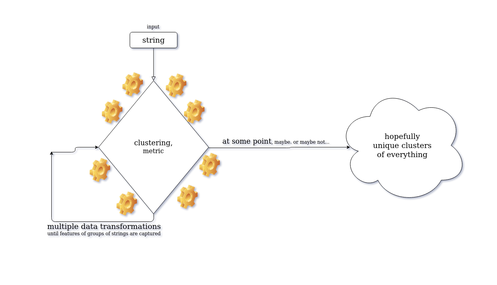

# Problem Description
## Part 1
- We want to build an entity normalization engine. The input to this
engine is short strings / phrases that could encompass the following
entities: company names, company addresses, serial numbers,
physical goods and locations.
- Fictional Examples:
- Company names: “Marks and Spencers Ltd”, “M&S Limited”,
“NVIDIA Ireland”, etc.
- Company addresses: “SLOUGH SE12 2XY”, “33 TIMBER YARD,
LONDON, L1 8XY”, “44 CHINA ROAD, KOWLOON, HONG
KONG”
- Serial numbers: “XYZ 13423 / ILD”, “ABC/ICL/20891NC”
- Physical Goods: “HARDWOOD TABLE”, “PLASTIC BOTTLE”
- Locations: “LONDON”, “HONG KONG”, “ASIA”
- Build a system that can identify unique entities for each category
above. Build one system for company names, one for company
addresses, etc. Some of these will be trivial (remove spaces, edit
distance, etc.) while others are more complicated and will need a
trained model / some other form of knowledge and guidance.- Examples:
- “Marks and Spencers Ltd” and “M&S Limited” are the same entity, but they differ from “NVIDIA Ireland”
- “LONDON” and “LONDON, ENG” are the same but they differ from “ASIA”
## Part 2
- Let’s do something real world now! Your system will receive strings
one by one and you have to group together any entities that you have
come across earlier.
- For example, imagine this stream: “MARKS AND SPENCERS LTD”,
“LONDON”, “ICNAO02312”, “LONDON, GREAT BRITAIN”, “TOYS”,
“INTEL LLC”, “M&S CORPORATION Limited”, “LONDON, ENGLAND”.
The groups that you would generate would then be:
- “MARKS AND SPENCERS LTD” + “M&S CORPORATION Limited”
- “LONDON” + “LONDON, GREAT BRITAIN” + “LONDON, ENGLAND”
- “ICNAO02312”
- “TOYS”
- “INTEL LLC”
- Note that you will not have access to the full stream to begin with.
Samples will appear incrementally when you have processed the
previous one. You have to pick the latest sample received, scan the
entries you already have, identify if the entity is a duplicate and then
add it to a cluster / create a new cluster depending on your result.

# Brainstrorming/notes/ideas/thoughts

It seems to me like there are two main directions to approaching this problem:
1. Raw text processing, withought taking into consideration entities, semantic information, morphology of strings, context, etc.. Create clusters right away. I could see this working to a certain extend, by projecting all of the strings' vector representations to a space and applying transformation after transormation with the hope that at some point, these transformations will capture the features that describe these groups. It certainly needs a lot of experimentation and could be very time consuming. We'll call this family of approaches __Team A__.
2. Text preprocessing, attempt to filter/predict the _type_ of each string depending on entity, context, morphology of sting, or any other information we can extract in order to classify the strings into one of the five categories (company names, company addresses, serial numbers, physical goods and locations), first, and then proceed with specific clustering tecniques that best fit each category respectively. We'll call this family of approaches __Team B__.

To put it in a nutshell, a big differentive factor of these two families of approaches, is the step of classification of a given string - whether it is a company name, company address, serial number, physical good or location. This is a whole system just by itself. I feel that if we could built such a system, pass each string through it, create the initial groups, and then apply clustering algorithms to each group seperately will give us better accuracy - this is just an intuition though.

### Potential Approaches
- Team A approaches - naive:
   * Naively treat all strings the same way, withought taking into consideration their entity or other information. Pick a clustering algorithm, a dinstance/similarity metric and create the clusters (experiment with various algorithms/metics combinations). 
   


- Team B approaches - filtering system first:
   1. Feed every sample through a Named Entity Recognition (NER) model to detect the entity to which each string belongs to, create the initial groups and then apply a clustering algorithm/metric to each group. The issue here is that current NER systems can't deal with company addresses, serial numbers, and physical goods, since these are not _named entities_. Subsequently, strings than have not been classified as _named entities_ by the model, will proceed directly to the clusternig phase. 
   


   2. Feed samples that have been classified as named entities from preveous step through a Named Entity Linking(NEL)/Disambiguation(NED)/Normalization(NEN) model ([there exist systems that can do both NER and Liniking](https://nlpprogress.com/english/entity_linking.html). This, at first glance, seem like a way to group together entities such: “Marks and Spencers Ltd”, “M&S Limited”. But, unfortunately, as far as I'm concerned, this requaries a Knowledge Base. Various models are trained on (have learned word embeddings) different KBs (eg. wikipedia, CoNLL). What happens if, for example, "M&S Limited" and similar strings does  not exist in that Knowlidge Base? This is an issue. However If this could work in real life, what we would expect to achieve is that company names and locations need not pass through a clustering procces. Hence, we are eliminating clustering inaccuracies a bit more.
   


   3. See if we can find appropriate sources, scrap the web, and create datasets of addresses, serial numbers, and physical goods. Create a corpus, train a model (learn word embeddings with word2vec maybe?) that can classify a string into one of these three classes. We could even attempt to build a custom NER model to include our new datasets. Here, based on the assumption that serial numbers and company addresses are _unique_, then that leaves us only the physical goods which need to be passed through a clustering process, but since these are real world physical items, word2vec on wikipedia/genism could also work.

### Approaches - Summary

As a first step, I will attempt to built a Team B system, leveraging a NER pre-trained model to filter company names and locations, create a group for company names, one for locations, and one for everything else. Then proceed to the clustering phase, where clustering algorithms will be applied to these groups separately in an atempt to minimize clustering error.


### Clustering algorithms that don't require #clusters apriori
  - Affinity propagation(graph based, the end result is a set of cluster ‘exemplars’)
  - Hierarchical clustering
  - Agglomerative Clustering (complete linkage)
  - DBSCAN
  - try all of the above with their default cluster metric, try them with levenshtein distance where possible
  - a general issue is the vectorization step. Scikit-learn estimators assume you’ll feed them real-valued feature vectors. This assumption is hard-coded in pretty much all of the library. Custom metrics for strings are hard to incorporate into these algorithm (at leas for now, given my current understanding)

### Notes/constraints
* Graph clustering algorithms could be a good choice since we are dealing with sting distance/similarity matrices - similar to graph distance/similarity matrices
  * potential graph clustering algo candidates:
    * Markov Clustering
    * Restricted Neighbourhood Search Clustering 
    * Louvain Clustering
    * Affinity Propagation Clustering
* company adresses are unique     
* serial numbers are unique
* flair can deal with: organazations, locations, everything else is an _"unknown_soup"_, need to filter the org and loc
* samples appear incrementaly - no access to the full stream -> update cluster params per data point observation
* DBSCAN is good at identifying outliers - might be a good idea to use it on locations and company names in an attempt to detect misclassifications of flair's named entity recognition model. [a very cool viz of the algorithm](https://www.naftaliharris.com/blog/visualizing-dbscan-clustering/) (choose pimpled smiley :P)
* for company names: ner + some sort of vectorization (word emb) or string similarity metric
* for goods: since they are real objects, word2vec on wikipedia could work
* for locations: ner + word2vec on wikipedia might work as well
* for serial numbers: some sort of defaul "nothing" since these are hypotheticaly unique
* for addresses: same as ser. nums
* clustering algos that can use string similarity metrics
* classic vectorization might not work (bag of words, tfidf) since they need more text/context (text documents)
* would be nice to built a separate system for each of the five categories - but how can we tell what techniques to apply to each category since we don't have this info beforehand? - The input is one string at a time - could be anything.


#### Datasets that could be used to (further) train models/learn word embeddings/create Knowledge Bases or create custom NERs in order to recognize company names and addresses more accurately
* ["Basic company data" from data.gov.uk __(company names, company addresses)__-UK companies](https://data.gov.uk/dataset/4462e41a-7413-4359-97f5-420b6ca5f9c0/basic-company-data)
* [SEC EDGAR database (US company names)](https://www.kaggle.com/dattapiy/sec-edgar-companies-list)
* [All active UK conpany names](https://www.kaggle.com/dalreada/all-uk-active-company-names)
* [OpenAddresses - U.S. West](https://www.kaggle.com/openaddresses/openaddresses-us-west)
* [OpenAddresses - Asia and Oceania](https://www.kaggle.com/openaddresses/openaddresses-asia-and-oceania)
* [OpenAddresses - Europe](https://www.kaggle.com/openaddresses/openaddresses-europe)
* [OpenAddresses - North America (excluding U.S.)](https://www.kaggle.com/openaddresses/openaddresses-north-america-excluding-us)
* [OpenAddresses - U.S. Northeast](https://www.kaggle.com/openaddresses/openaddresses-us-northeast)
* [OpenAddresses - South America](https://www.kaggle.com/openaddresses/openaddresses-south-america)
* [OpenAddresses - U.S. South](https://www.kaggle.com/openaddresses/openaddresses-us-south)
* [OpenAddresses - U.S. Midwest](https://www.kaggle.com/openaddresses/openaddresses-us-midwest)
* [Melbourne Housing Market (contains addresses)](https://www.kaggle.com/anthonypino/melbourne-housing-market)
* [Indian hotels on Booking.com (contains addresses)](https://www.kaggle.com/PromptCloudHQ/indian-hotels-on-bookingcom)


# Usage (tested on Ubuntu 18.04.4 LTS)
0.. make sure you have [miniconda](https://docs.conda.io/en/latest/miniconda.html), 
[anaconda](https://docs.anaconda.com/anaconda/install/linux/) or any other python virtual environment installed.      

1.. open a terminal and download the project:
```bash
git clone https://github.com/chrisgks/entity-normalization-engine.git
```
2.. cd to project directory:
```bash
cd entity-normalization-engine   
```
3.. create new conda env and install conda packages:
```bash
conda create --name vectorai python=3.8
```
4.. activate the newly created virtual environment:
```bash
conda activate vectorai  
```
5.. install pip packages
```bash
pip install -r pip_requirements.txt     
```
6.. try main.py
```bash
python main.py     
```
7.. try hyper_parameter_exploration.py
```bash
python hyper_parameter_exploration.py
```
8.. check results folder
