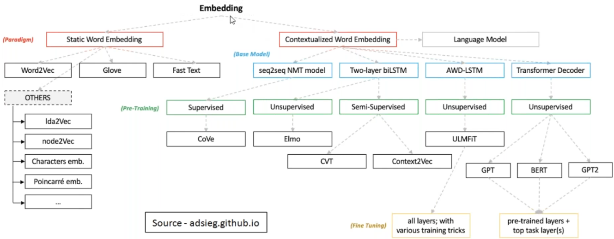
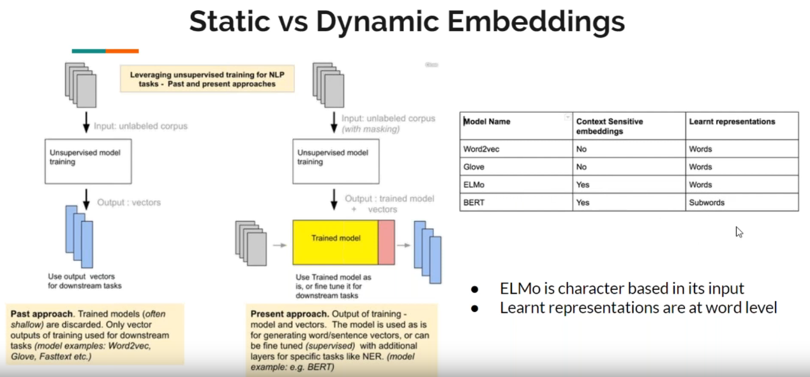

# Notes

## About Flair
transformer pretrained models to choose from: https://huggingface.co/transformers/pretrained_models.html
any of these can be used https://huggingface.co/transformers/pretrained_models.html  :O
* Flair Embeddings - Significance of Backwards vs Forwards?
    * Upon further research I found that during training forward language models try to predict the next word in a 
    sequence. Backwards language models on the other hand start at the end of a sequence and attempt to predict the
    proceeding word. It seems that by stacking both forward and backwards models produced from the same data-set you 
    get better results than using a forward or backwards model alone.
    
 * Flair's Contextual String Embeddings
    * context
        * words can have multiple meanings (polysemy)
        * embeddings for same word are different based on context
    * Character-level language model (input: sequence of characters. On the other hand sequence of words assumes 
    a pre-defined vocabulary, so usually we have issues with OOV words)
        * character-level language model that forms word-level enbeddings
        * les susceptible to misspellings
        * can handle OOV words
        * works well with prefixes and suffixes
    * flair's paper
        * contextual string embedding -> stacking: concatenation of forward and backward embeddings
            * forward character embedding: uses everything up to the last character of the current word
            * backward character embedding: uses everything from the end of the input to the first character of the 
            current word
        * state of the art results achieved stacking forward, backward, and Glove enbeddings
 * Flair Embeddings
    * flair is purely character-based and is trained without an explicit notion of a word
    * embedding are extracted in flair from the first and last character states of each word to generate a word embedding
 
        
## Others

word embeddings = word vector = distributed representations    
it is a dense representation of words in a low-dimensional vector space    
* one-hot representation:
king = [1 0 0 0 0 0]
queen = [0 1 0 0 0 0]
book = [0 0 1 0 0 0]
a vector for every word, can't capture relationships between words

* Distrebuted representation:

much less dimensions 2, 100, but not thousants, much smaller vectors *the meaning is distributed across all the dimentions*
king is not stuck in the first column, the meaning is distributed among the 3 dimensions, its, 0.3 of this word, 0.8 of that word etc.
that's why it's called distributed    
    
how to come up with these vectors?    
* Fastetext: word is a sum of its parts: going = go + oi + in + ng + goi + oin + ing
    * captures morphology of word - better from word2vec for this reason - apart from this subword thing word2vec and fasttext are the same
    fasttext is slower than word2vec
* word2vec is actually a classification algorithm, it's trying to find the closest meanin-wise word to another
for example: input: Context Cute, output: output: word Kitten

## Types of embeddings

word representation progress in nlp field
* Static Word Embeddings:
    1. generate the same embedding for the same word in different contexts
    2. the output is just the word vectors for downstream tasks
    3. word vectors will only capture the semantic meaning of words
    4. the word embedings will incorporate the previous knowledge in the first layer of the model 
    * one-hot encoding: can't capture the relation between words
    * statistical methods: tfidf, bof, frequency of words in vocab and sentences, can't capture syntax/semantics
    * word2vec: 2 models
        * cbow model: single layer nn. Predict a target word given surrounding words
        * skip-gram model:  predict surrounding words given a target word
    * Glove, Fast Text: global word representation, based on co-occurence matrix

* Contextualized (Dynamic) Word Embeddings
    1. these embeddings aim at capturing word semantics in different contexts to adress the issue of polysemous and
    the context-dependent nature of words
    2. the output of contextualized word embedding is the trained model and the word vectors
    3. long-term dependencies, agreement, negation, anaphora are not considered
    4. the remaining network has to be trained from scratch for every downstream task
    * based on the downstream task we can fine-tune models pre-trained on huge datasets
    * ELMo: is a word-level language model, representations are character based, allowing the network to use
     morphological clues to form robust
    representations for OOV words unseen in training. Takes into account syntactic and semantic info, 
    context of every word based on surrounding text. characters are sent to CNN (filters extract features) 
    with max-pooling(extract the most important features extracted from filters), from there 
    to highway network(similar to memory of lstm) then we get the actual embeddings
    * BERT: As opposed to directional models, which read the text input sequentially (left-to-right or right-to-left), 
    the Transformer encoder reads the entire sequence of words at once. Therefore it is considered bidirectional, 
    though it would be more accurate to say that it’s non-directional. This characteristic allows the model to learn 
    the context of a word based on all of its surroundings (left and right of the word).
        * Bidirectional, left and right at the same time
    

    

* dbscan clustering algorithm:
    * DBSCAN - Density-Based Spatial Clustering of Applications with Noise.
    Finds core samples of high density and expands clusters from them.
    Good for data which contains clusters of similar density.    
    __question__: does our data assumes clusters of similar density?
